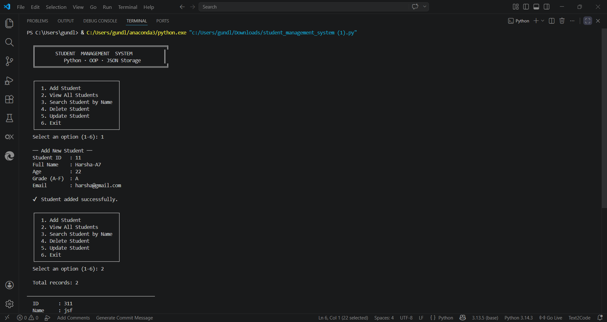

# 🎓 Student Management System

A simple **Python-based console application** to manage student records using **OOP (Object-Oriented Programming)** and **JSON file storage**.

---

## 🚀 Features

* ➕ Add new student
* 📋 View all students
* 🔍 Search student by name
* ❌ Delete student record
* ✏️ Update student details
* 💾 Persistent storage using JSON

---

## 🛠️ Technologies Used

* Python
* File Handling (JSON)
* OOP Concepts

---

## 📂 Project Structure

```
student-management-system/
│── student_management_system.py
│── students.json
│── README.md
```

---

## 🖥️ Sample Menu

```
1. Add Student
2. View All Students
3. Search Student
4. Delete Student
5. Update Student
6. Exit
```
## 📸 Output Screenshot


---

## 📌 Future Improvements

* GUI using Tkinter / Web app using Flask
* Database integration (MySQL / MongoDB)
* Authentication system

---


## 👨‍💻 Author

Harsha

